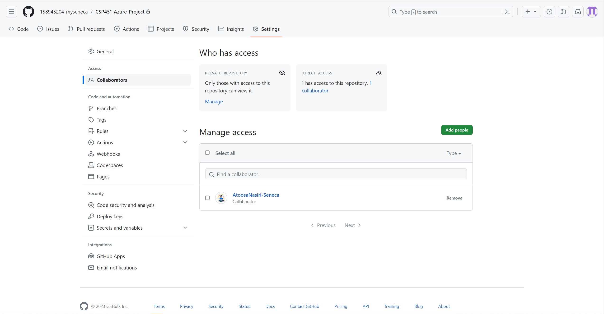

# CSP451-Azure-Project

### Checkpoint1 Submission

- **COURSE INFORMATION: CSP451NIA**
- **STUDENT’S NAME: Kenneth Chu**
- **STUDENT'S NUMBER: 158945204**
- **GITHUB USER_ID: 158945204-myseneca**
- **TEACHER’S NAME: Atoosa Nasiri**

---

### Table of Contents

- [My Collaborators](#collaborators-image)
- [Single Line of Code](#single-line-code-snippet)
- [Multi-Line Code Snippet](#multi-line-code-snippet)
- [Sample .json object](#sample-json-object)
- [Sample Table](#sample-table)
- [Sample Hyperlink](#sample-hyperlink)

---

## Collaborators Image


---

## Single Line Code Snippet
This is my single line of code. In Linux, to list all files and directories, use `ls -la`.

---

## Multi Line Code Snippet
This is my multi line code snippet. In order for Bash to display Hello World, use the following code in a text editor.

```
#!/bin/sh
# This is bash program to display Hello World
echo " Hello World "
```

This code was taken from this [link](https://www.geeksforgeeks.org/bash-script-write-hello-world-program/)

---

## Sample `.json` object
```
<!DOCTYPE html>
<html>
  <head>
    <title>Test Javascript</title>
    <script type="text/javascript">
      let hello_world = {"Hello":"World"};
      alert(hello_world.Hello);
    </script>
  </head>
  <body>
    <h2>JSON Hello World</h2>
    <p>This is a test program to alert Hello world!</p>
  </body>
</html>
```

This code was taken from this [link](https://subscription.packtpub.com/book/web-development/9781788624701/1/ch01lvl1sec11/the-hello-world-program-with-json)

---

## Sample Table

| Left-aligned | Center-aligned | Right-aligned |
| :---         |     :---:      |          ---: |
| git status   | git status     | git status    |
| git diff     | git diff       | git diff      |

This table was taken from this [link](https://docs.github.com/en/get-started/writing-on-github/working-with-advanced-formatting/organizing-information-with-tables)

---

## Sample Hyperlink

This is an example of a [hyperlink](https://bongo.cat/)
