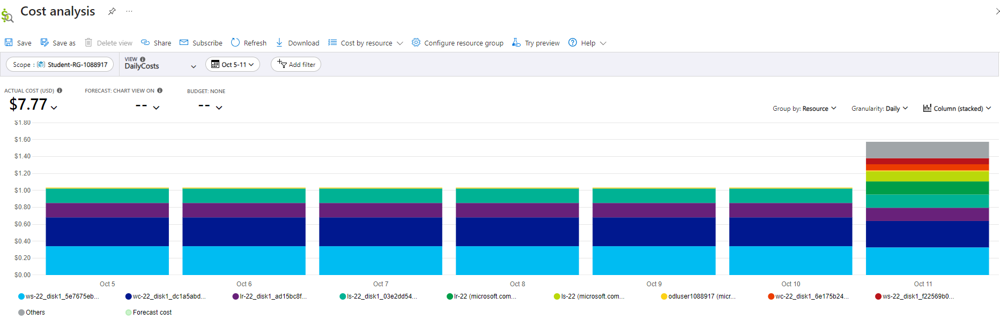
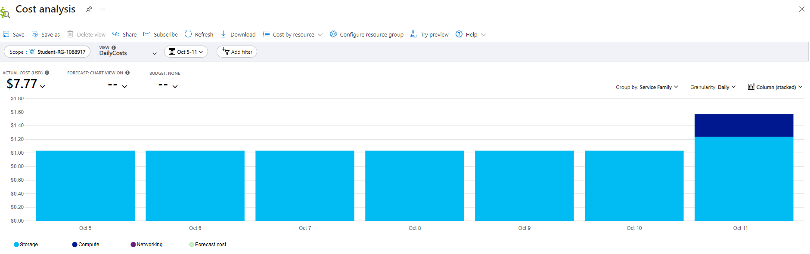
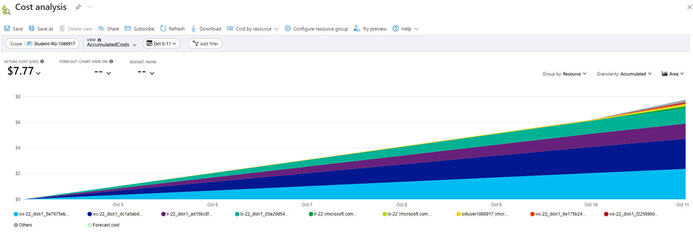
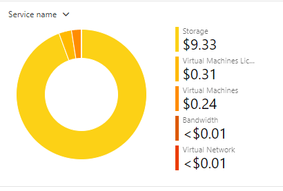
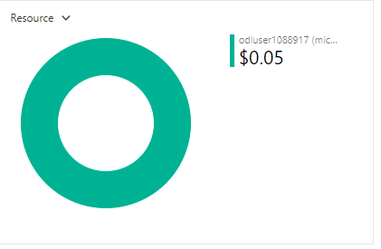
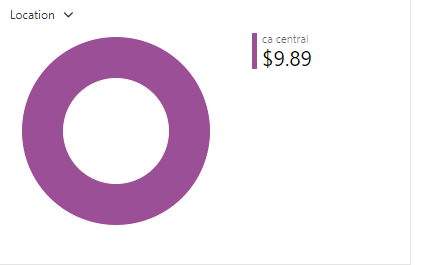
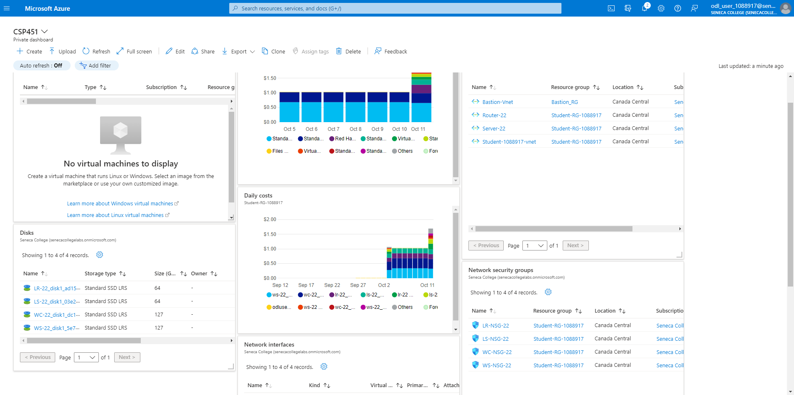

# CSP451-Azure-Project

### Checkpoint4 Submission

- **COURSE INFORMATION: CSP451NIA**
- **STUDENT’S NAME: Kenneth Chu**
- **STUDENT'S NUMBER: 158945204**
- **GITHUB USER_ID: 158945204-myseneca**
- **TEACHER’S NAME: Atoosa Nasiri**

---

### Table of Contents
1. [Part A - Creating & Configuring VMs - Using Portal](#part-a---creating--configuring-vms---using-portal)
2. [Part B - Enable IP Forwarding - Using Portal](#part-b---enable-ip-forwarding---using-portal)
3. [Part C - Basic Connectivity - VM Configuration](#part-c---basic-connectivity---vm-configuration)
4. [Part D - Creating & Configuring VM Images - Using Portal](#part-d---creating--configuring-vm-images---using-portal)
5. [Part E - Azure Cost Analysis Charts](#part-e---azure-cost-analysis-charts)
6. [Part F - Create Customized Azure Dashboard](#part-f---create-customized-azure-dashboard)


# Part A - Creating & Configuring VMs - Using Portal

1. What is the difference between Windows machine NSG and Linux machine NSG rules? Why? **Do not give screenshots** just describe the difference? Do you need a rule for `ssh` or `rdp`? What happens if you delete specific `ssh` and `rdp` rules?

>Windows and Linux machines in Microsoft Azure use Network Security Groups (NSGs) to control the traffic coming in and out. Some key differences for Windows, is that it's like opening a door on port 3389 for Remote Desktop (RDP), while Linux prefers port 22 for Secure Shell (SSH). We can imagine these ports as entry points for managing our computer remotely. If we were to delete the RDP or SSH rules, it would be the equivalent of like closing and locking that door, essentially no more remote access. So, it's pretty crucial to keep those rules unless we want to make our machine inaccessible from afar. We have to be careful messing around with these rules, or else we might accidentally lock ourselves out.

2. Work from Azure Bash CLI in **Portal** to get a list of your VM, NSG, NIC, and Disks. You can start with the below commands. Make sure the outputs in table format are embedded in your submission.

```
az group list --out table
```

| Name                | Location       | Status    |
|---------------------|----------------|-----------|
| Bastion_RG          | canadacentral  | Succeeded |
| NetworkWatcherRG    | canadacentral  | Succeeded |
| Student-RG-1088917  | canadacentral  | Succeeded |

```
az vm list -g $RG -o table
```

| Name  | ResourceGroup       | Location       | Zones |
|-------|---------------------|----------------|-------|
| LR-22 | Student-RG-1088917  | canadacentral  | 1     |
| LS-22 | Student-RG-1088917  | canadacentral  | 1     |
| WC-22 | Student-RG-1088917  | canadacentral  | 1     |
| WS-22 | Student-RG-1088917  | canadacentral  | 1     |

```
az network nic list -g $RG -o table
```

| AuxiliaryMode    | AuxiliarySku  | DisableTcpStateTracking | EnableAcceleratedNetworking | EnableIPForwarding | Location       | MacAddress         | Name         | NicType  | ProvisioningState | ResourceGroup       | ResourceGuid                                      | VnetEncryptionSupported | Primary |
|-------------------|---------------|--------------------------|-----------------------------|---------------------|-----------------|---------------------|--------------|----------|--------------------|---------------------|---------------------------------------------------|--------------------------|---------|
| None              | None          | False                    | False                       | False               | canadacentral  | 60-45-BD-5C-FC-03  | lr-22        | Standard | Succeeded          | Student-RG-1088917  | 97112dc7-dd02-4b32-be52-2ca13c1dde86              | False                    |         |
| None              | None          | False                    | False                       | True                | canadacentral  | 00-22-48-AF-8A-34  | lr-22236_z1  | Standard | Succeeded          | Student-RG-1088917  | ec52d065-ce49-4dbc-ae07-d18093538b7d              | False                    | True    |
| None              | None          | False                    | False                       | False               | canadacentral  | 00-0D-3A-F3-09-90  | ls-22        | Standard | Succeeded          | Student-RG-1088917  | 7eb76aee-2baa-439f-8c03-066a6d9b74b3              | False                    |         |
| None              | None          | False                    | False                       | False               | canadacentral  | 00-22-48-B1-71-0B  | ls-22292_z1  | Standard | Succeeded          | Student-RG-1088917  | 44796d42-ed3f-4059-aace-37ce2ca7b793              | False                    | True    |
| None              | None          | False                    | False                       | False               | canadacentral  | 00-22-48-B1-A8-17  | wc-22        | Standard | Succeeded          | Student-RG-1088917  | 16ee8ee8-cb86-4e3f-ba4e-2e5e1def7f6d              | False                    |         |
| None              | None          | False                    | False                       | False               | canadacentral  | 00-22-48-B2-FB-D4  | wc-22844_z1  | Standard | Succeeded          | Student-RG-1088917  | 6c2b75f9-80e9-4184-9a13-0e10454883d9              | False                    | True    |
| None              | None          | False                    | False                       | False               | canadacentral  | 60-45-BD-5D-0C-F3  | ws-22        | Standard | Succeeded          | Student-RG-1088917  | c8fc30e8-de23-4887-86d5-df64f0a906a0              | False                    |         |
| None              | None          | False                    | False                       | False               | canadacentral  | 00-0D-3A-84-DA-CC  | ws-22203_z1  | Standard | Succeeded          | Student-RG-1088917  | 177935fc-5423-4831-8aef-abc411fd5890              | False                    | True    |

```
az network nsg list --output table
```

| Location       | Name       | ProvisioningState | ResourceGroup       | ResourceGuid                              |
| --------------- | ---------- | ------------------ | ------------------- | ----------------------------------------- |
| canadacentral   | LR-NSG-22  | Succeeded          | Student-RG-1088917  | 3b9ce5cd-e32e-49a3-9867-51a6e8d41015      |
| canadacentral   | LS-NSG-22  | Succeeded          | Student-RG-1088917  | 09819b5a-d77c-42f0-aed5-5fdfa8b896f6      |
| canadacentral   | WC-22-nsg  | Succeeded          | Student-RG-1088917  | d862dac0-c91b-4298-a1aa-0ec26c50828a      |
| canadacentral   | WC-NSG-22  | Succeeded          | Student-RG-1088917  | d1ae5640-56de-4328-b781-38a92ccec205      |
| canadacentral   | WS-NSG-22  | Succeeded          | Student-RG-1088917  | 95c9acb2-eab6-4262-b2e1-1ead679699b9      |

```
az disk list --output table
```

| Name                                            | ResourceGroup       | Location       | Zones | Sku              | OsType  | SizeGb | ProvisioningState |
|-------------------------------------------------|---------------------|----------------|-------|------------------|---------|--------|-------------------|
| LR-22_disk1_ad15bc8f18424826898b089c20b4bb20    | STUDENT-RG-1088917  | canadacentral  |       | StandardSSD_LRS  | Linux   | 64     | Succeeded         |
| LR-22_disk1_cf724a7c91214994974ebb93428d9e6e    | STUDENT-RG-1088917  | canadacentral  | 1     | Standard_LRS     | Linux   | 64     | Succeeded         |
| LS-22_disk1_03e2dd543f574ac9a8a34c0250e56b81    | STUDENT-RG-1088917  | canadacentral  |       | StandardSSD_LRS  | Linux   | 64     | Succeeded         |
| LS-22_disk1_6ba3cec334834611990dd5d27e0b584b    | STUDENT-RG-1088917  | canadacentral  | 1     | Standard_LRS     | Linux   | 64     | Succeeded         |
| WC-22_disk1_6e175b24f3044b4eb2613ec47ce596df    | STUDENT-RG-1088917  | canadacentral  | 1     | Standard_LRS     | Windows | 127    | Succeeded         |
| WC-22_disk1_dc1a5abd232746c2907e3dba21063691    | STUDENT-RG-1088917  | canadacentral  |       | StandardSSD_LRS  | Windows | 127    | Succeeded         |
| WS-22_disk1_5e7675ebe048465198dacdd5ff3f2817    | STUDENT-RG-1088917  | canadacentral  |       | StandardSSD_LRS  | Windows | 127    | Succeeded         |
| WS-22_disk1_f22569b06b6c4c1db64e8283aeea3887    | STUDENT-RG-1088917  | canadacentral  | 1     | Standard_LRS     | Windows | 127    | Succeeded         |

# Part B - Enable IP_Forwarding - Using Portal

1. Check the status of ip-forwarding using the command az network nic ip-config show with output format as json. Include only the command not output including the --quey you used in your submission.

```
az network nic show --resource-group Student-RG-1088917 --name lr-22236_z1 --output json
```

```json
{
  "name": "lr-22236_z1",
  "id": "/subscriptions/71d310bf-1718-4d11-87d1-99a7d4e2053f/resourceGroups/Student-RG-1088917/providers/Microsoft.Network/networkInterfaces/lr-22236_z1",
  "etag": "W/\"a0e2ff91-b0e6-4cd9-8f78-e22188c3132a\"",
  "tags": {
    "DeploymentId": "1088917",
    "LaunchId": "35764",
    "LaunchType": "ON_DEMAND_LAB",
    "TemplateId": "7026",
    "TenantId": "353"
  },
  "properties": {
    "provisioningState": "Succeeded",
    "resourceGuid": "ec52d065-ce49-4dbc-ae07-d18093538b7d",
    "ipConfigurations": [
      {
        "name": "ipconfig1",
        "id": "/subscriptions/71d310bf-1718-4d11-87d1-99a7d4e2053f/resourceGroups/Student-RG-1088917/providers/Microsoft.Network/networkInterfaces/lr-22236_z1/ipConfigurations/ipconfig1",
        "etag": "W/\"a0e2ff91-b0e6-4cd9-8f78-e22188c3132a\"",
        "type": "Microsoft.Network/networkInterfaces/ipConfigurations",
        "properties": {
          "provisioningState": "Succeeded",
          "privateIPAddress": "192.168.22.37",
          "privateIPAllocationMethod": "Dynamic",
          "subnet": {
            "id": "/subscriptions/71d310bf-1718-4d11-87d1-99a7d4e2053f/resourceGroups/Student-RG-1088917/providers/Microsoft.Network/virtualNetworks/Router-22/subnets/SN1"
          },
          "primary": true,
          "privateIPAddressVersion": "IPv4"
        }
      }
    ],
    "dnsSettings": {
      "dnsServers": [],
      "appliedDnsServers": []
    },
    "macAddress": "00-22-48-AF-8A-34",
    "enableAcceleratedNetworking": false,
    "vnetEncryptionSupported": false,
    "enableIPForwarding": true,
    "networkSecurityGroup": {
      "id": "/subscriptions/71d310bf-1718-4d11-87d1-99a7d4e2053f/resourceGroups/Student-RG-1088917/providers/Microsoft.Network/networkSecurityGroups/LR
```

2. When your output format is json, which property shows the status of the ip-forwarding attribute? Embed only the property that shows the status of ip-forwarding.

```
{
  "enableIpForwarding": true
}
```

# Part C - Basic Connectivity - VM Configuration

1. In configuring your Linux VMs, for the step "Remove the firewalld service", which command will you be using?

```
# Remove the firewalld service
sudo firewall-cmd --state
sudo systemctl stop firewalld
sudo systemctl disable firewalld
sudo systemctl mask --now firewalld
sudo systemctl status firewalld
```

2. In configuring your Linux VMs, what command do you use to check the status of iptabels?

```
sudo iptables -nvL
```

3. How can you make iptables service start automatically after reboot on CenOS/RHEL8? 👉 Hint: RHEL7: How to disable Firewalld and use Iptables instead

```
# Disable Firewall
sudo systemctl stop firewalld
sudo systemctl disable firewalld

# Install iptables services
sudo yum install iptables-services
sudo systemctl enable iptables
sudo systemctl start iptables
sudo systemctl status iptables
```

4. Run a command in LR-xx that shows all iptables chains with their order number. What is the default setting? Include both the command and its output in your submission. How could you improve these settings to be less vulnerable to attacks?

```
[kchu29@LR-22 ~]$ sudo iptables -nvL
```
```
Chain INPUT (policy ACCEPT 0 packets, 0 bytes)
 pkts bytes target     prot opt in     out     source               destination
 1050  296K ACCEPT     all  --  *      *       0.0.0.0/0            0.0.0.0/0            state RELATED,ESTABLISHED
    0     0 ACCEPT     icmp --  *      *       0.0.0.0/0            0.0.0.0/0
    0     0 ACCEPT     all  --  lo     *       0.0.0.0/0            0.0.0.0/0
    1    52 ACCEPT     tcp  --  *      *       0.0.0.0/0            0.0.0.0/0            state NEW tcp dpt:22
    6   348 REJECT     all  --  *      *       0.0.0.0/0            0.0.0.0/0            reject-with icmp-host-prohibited

Chain FORWARD (policy ACCEPT 0 packets, 0 bytes)
 pkts bytes target     prot opt in     out     source               destination
    0     0 REJECT     all  --  *      *       0.0.0.0/0            0.0.0.0/0            reject-with icmp-host-prohibited

Chain OUTPUT (policy ACCEPT 1404 packets, 343K bytes)
 pkts bytes target     prot opt in     out     source               destination
```

By default, our system is pretty open to any incoming and outgoing traffic, like a friendly doorman letting everyone in. In order to boost security, we can think of changing the doorman's role to a bit more cautious one. Setting the default rules to DROP, meaning deny unless we say otherwise. Imagine we're the bouncer at a club—only let in the folks on your VIP list. Specifying which services or ports also a way to improve the settings, like waving in specific guests. We also shouldnt forget to keep an eye on the crowd size; limit the number of incoming connections to avoid overcrowding issues. Making these changes with care, though, because if we're too strict it may leave us locked out. We should test any rules we wish to implement first and have a backup plan to access our system, just in case. We can think of it as tightening up security while still keeping the doors open for the right guests.

```
[kchu29@LS-22 ~]$ sudo iptables -nvL
```

```
Chain INPUT (policy ACCEPT 1458 packets, 385K bytes)
 pkts bytes target     prot opt in     out     source               destination

Chain FORWARD (policy ACCEPT 0 packets, 0 bytes)
 pkts bytes target     prot opt in     out     source               destination

Chain OUTPUT (policy ACCEPT 1916 packets, 463K bytes)
 pkts bytes target     prot opt in     out     source               destination
```

5. Run a command that shows the hostname in LR-XX and LX-XX. Embed the output in your submission.

```
[kchu29@LR-22 ~]$ hostname
LR-22
```

```
[kchu29@LS-22 ~]$ hostname
LS-22
```
# Part D - Creating & Configuring VM Images - Using Portal

1. Run a command in CLI that lists all your Custom Images. Hint: az image list .... Change the output format to table format and embed the answer in your submission.

```
odl_user [ ~ ]$ az image list --output table
```

```
HyperVGeneration    Location       Name             ProvisioningState    ResourceGroup
------------------  -------------  ---------------  -------------------  ------------------
V2                  canadacentral  lr-22-ver-0.0.1  Succeeded            STUDENT-RG-1088917
V2                  canadacentral  ls-22-ver-0.0.1  Succeeded            STUDENT-RG-1088917
V2                  canadacentral  wc-22-ver-0.0.1  Succeeded            STUDENT-RG-1088917
V2                  canadacentral  ws-22-ver-0.0.1  Succeeded            STUDENT-RG-1088917
```
2. Delete your VMs after your work is completed. Run a command in CLI that lists all your VMs. Hint: az vm list .... Change the output format to table format and embed the answer in your submission.

```
odl_user [ ~ ]$ az vm list --output table
```

```
odl_user [ ~ ]$ az vm list --output table
```
3. Recreate all VMs from your images, and establish basic connectivity. How long the entire process took? How can you do this more efficiently?
```
To streamline the whole Azure VM management process, there are a few tricks that can be implemented. First up, embrace ARM templates. They're like the maestros of orchestration, letting you define and deploy all the VM-related goods in one go. We can think of it as setting up a VM orchestra with a single conductor's baton. Next, we can hop onto the automation train. Whether it's Azure Automation or scripting like PowerShell or Azure CLI, having automation onboard can turn the manual grind into an automated ballet. Lastly, make use of managed disks. These disks bring a lot to the table—high availability and simplified disk handling. It's like having a trusty sidekick for your VM adventures. So, when it comes to spinning up VMs from custom images, ARM templates, automation, and managed disks are your backstage passes to a faster and smoother show.
```

# Part E - Azure Cost Analysis Charts

## Azure Cost Analysis Charts

| No. | Scope | Chart Type | VIEW Type |  Date Range | Group By | Granularity| Example |
|-|-|-|-|-|-|-|-|
|1|Student-RG-xxxxxx| Column (Stacked) | DailyCosts | Last 7 Days | Resource | Daily |  |
|2|Student-RG-xxxxxx| Column (Stacked) | DailyCosts | Last 7 Days | Service | Daily |  |
|3|Student-RG-xxxxxx| Area| AccumulatedCosts | Last 7 Days | Resource | Accumulated |  |
|4|Student-RG-xxxxxx| Pie Chart | NA | Last Month | Service Name | NA |  |
|5|Student-RG-xxxxxx| Pie Chart | NA | Last Month | Service Family | NA |  |
|6|Student-RG-xxxxxx| Pie Chart | NA | Last Month | Product | NA |  |

# Part F - Create Customized Azure Dashboard
