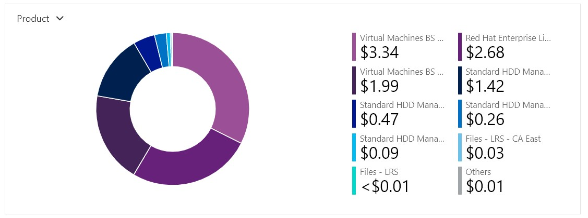

# Azure Cost Analysis Charts

Add this to your `README.md` and make sure to update `Student-RG-xxxxxx` with your student resource group number.

| No. | Scope | Chart Type | VIEW Type |  Date Range | Group By | Granularity| Example |
|-|-|-|-|-|-|-|-|
|1|Student-RG-xxxxxx| Column (Stacked) | DailyCosts | Last 7 Days | Resource | Daily |  |
|2|Student-RG-xxxxxx| Column (Stacked) | DailyCosts | Last 7 Days | Service | Daily |  |
|3|Student-RG-xxxxxx| Area| AccumulatedCosts | Last 7 Days | Resource | Accumulated |  |
|4|Student-RG-xxxxxx| Pie Chart | NA | Last Month | Service Name | NA |  |
|5|Student-RG-xxxxxx| Pie Chart | NA | Last Month | Service Family | NA |  |
|6|Student-RG-xxxxxx| Pie Chart | NA | Last Month | Product | NA |  |
