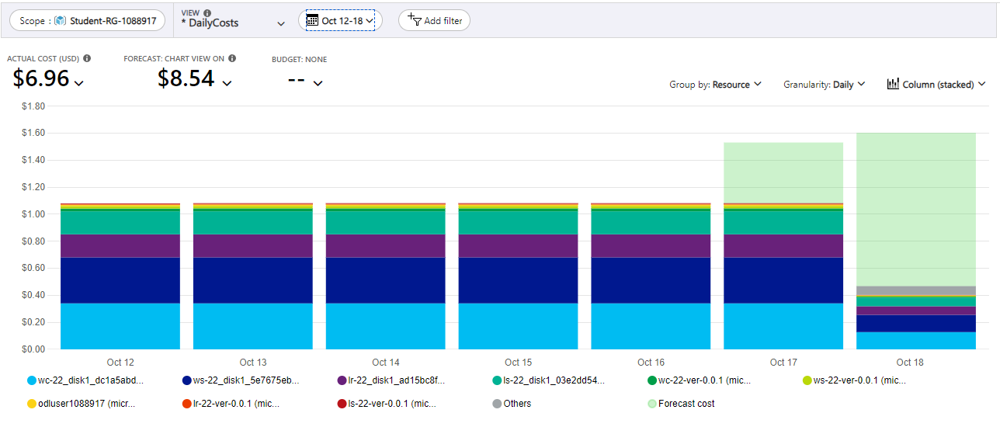
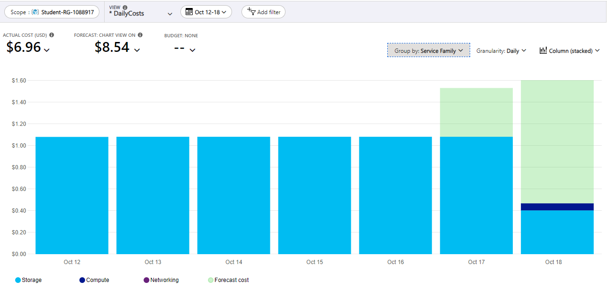
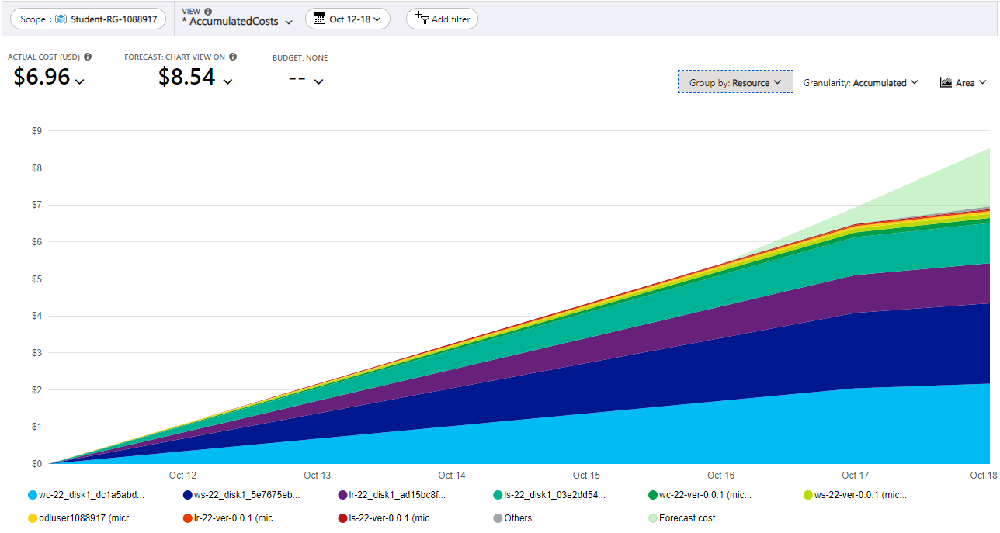
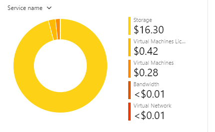
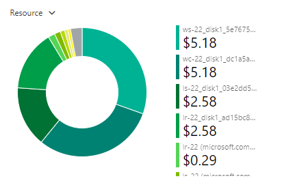
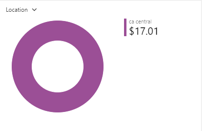
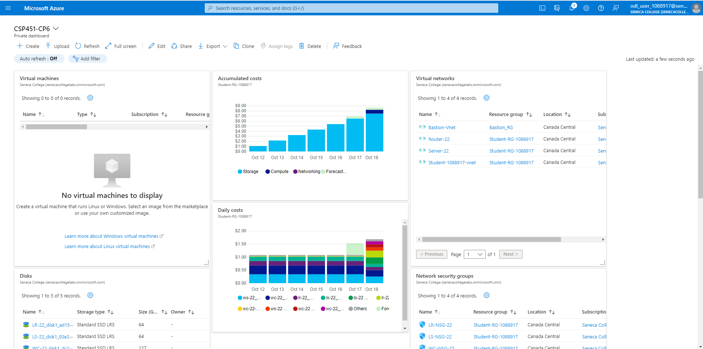

# CSP451-Azure-Project

### Checkpoint6 Submission

- **COURSE INFORMATION: CSP451NIA**
- **STUDENT’S NAME: Kenneth Chu**
- **STUDENT'S NUMBER: 158945204**
- **GITHUB USER_ID: 158945204-myseneca**
- **TEACHER’S NAME: Atoosa Nasiri**

---

# Table of Contents
1. [Part A - Creating & Configuring VMs - Using Azure CLI Scripts](#part-a---creating--configuring-vms---using-azure-cli-scripts)
2. [Part B - Basic Connectivity - Linux VMs Firewall Setting](#part-b---basic-connectivity---linux-vms-firewall-setting)
3. [Part C - Azure Cost Analysis Charts](#part-c---azure-cost-analysis-charts)

## Part A - Creating & Configuring VMs - Using Azure CLI Scripts

1. Get a list of your VM, NSG, NIC, and Disks using Azure CLI in table format. Do not include screenshots, just embed the output in table format in your submission.

```
az vm list --output table
```

### VMs

| Name  | Resource Group       | Location       | Zones           |
|------|-----------------------|-----------------|-----------------|
| LR-22 | STUDENT-RG-1088917   | canadacentral   | -               |
| LS-22 | STUDENT-RG-1088917   | canadacentral   | -               |
| WC-22 | STUDENT-RG-1088917   | canadacentral   | -               |
| WS-22 | STUDENT-RG-1088917   | canadacentral   | -               |

```
az network nsg list --output table
```

### Network Security Groups (NSGs)

| Location       | Name       | Provisioning State  | Resource Group       | Resource GUID                                |
|-----------------|------------|---------------------|----------------------|----------------------------------------------|
| canadacentral   | LR-NSG-22  | Succeeded          | Student-RG-1088917  | 3b9ce5cd-e32e-49a3-9867-51a6e8d41015         |
| canadacentral   | LS-NSG-22  | Succeeded          | Student-RG-1088917  | 09819b5a-d77c-42f0-aed5-5fdfa8b896f6         |
| canadacentral   | WC-NSG-22  | Succeeded          | Student-RG-1088917  | d1ae5640-56de-4328-b781-38a92ccec205         |
| canadacentral   | WS-NSG-22  | Succeeded          | Student-RG-1088917  | 95c9acb2-eab6-4262-b2e1-1ead679699b9         |

```
az network nic list --output table
```

### Network Interface Cards (NICs)

| Auxiliary Mode  | Auxiliary SKU  | Disable Tcp State Tracking  | Enable Accelerated Networking  | Enable IP Forwarding  | Location        | MAC Address        | Name   | NIC Type  | Primary  | Provisioning State  | Resource Group       | Resource GUID                            | Vnet Encryption Supported  |
|-----------------|-----------------|-----------------------------|-------------------------------|----------------------|------------------|--------------------|--------|-----------|----------|----------------------|----------------------|----------------------------------------|---------------------------|
| None            | None            | False                       | False                         | True                 | canadacentral    | 60-45-BD-5C-FC-03  | lr-22  | Standard  | True     | Succeeded            | Student-RG-1088917  | 97112dc7-dd02-4b32-be52-2ca13c1dde86 | False                     |
| None            | None            | False                       | False                         | False                | canadacentral    | 00-0D-3A-F3-09-90  | ls-22  | Standard  | True     | Succeeded            | Student-RG-1088917  | 7eb76aee-2baa-439f-8c03-066a6d9b74b3 | False                     |
| None            | None            | False                       | False                         | False                | canadacentral    | 00-22-48-B1-A8-17  | wc-22  | Standard  | True     | Succeeded            | Student-RG-1088917  | 16ee8ee8-cb86-4e3f-ba4e-2e5e1def7f6d | False                     |
| None            | None            | False                       | False                         | False                | canadacentral    | 60-45-BD-5D-0C-F3  | ws-22  | Standard  | True     | Succeeded            | Student-RG-1088917  | c8fc30e8-de23-4887-86d5-df64f0a906a0 | False                     |

```
az disk list --output table
```

### Disks

| Name                                              | Resource Group       | Location       | Zones | Sku              | Os Type | Size (GB) | Provisioning State |
|---------------------------------------------------|----------------------|-----------------|-------|------------------|---------|-----------|---------------------|
| LR-22_disk1_1b614e55b77b492eaf8e1ca98ae60c69      | STUDENT-RG-1088917   | canadacentral   |       | StandardSSD_LRS  | Linux   | 64        | Succeeded           |
| LR-22_disk1_ad15bc8f18424826898b089c20b4bb20      | STUDENT-RG-1088917   | canadacentral   |       | StandardSSD_LRS  | Linux   | 64        | Succeeded           |
| LS-22_disk1_03e2dd543f574ac9a8a34c0250e56b81      | STUDENT-RG-1088917   | canadacentral   |       | StandardSSD_LRS  | Linux   | 64        | Succeeded           |
| LS-22_disk1_9a8d25e2ca0f4135a7d3045577f48169      | STUDENT-RG-1088917   | canadacentral   |       | StandardSSD_LRS  | Linux   | 64        | Succeeded           |
| WC-22_disk1_dc1a5abd232746c2907e3dba21063691      | STUDENT-RG-1088917   | canadacentral   |       | StandardSSD_LRS  | Windows | 127       | Succeeded           |
| WC-22_disk1_f8d2d422e3724976a52b1b7a6c616ad6      | STUDENT-RG-1088917   | canadacentral   |       | StandardSSD_LRS  | Windows | 127       | Succeeded           |
| WC-22_OsDisk_1_750152eea14e4722998b086501439e0a   | STUDENT-RG-1088917   | canadacentral   |       | StandardSSD_LRS  | Windows | 127       | Succeeded           |
| WS-22_disk1_5e7675ebe048465198dacdd5ff3f2817      | STUDENT-RG-1088917   | canadacentral   |       | StandardSSD_LRS  | Windows | 127       | Succeeded           |
| WS-22_disk1_6dd3c912a23440a98d415a404a329029      | STUDENT-RG-1088917   | canadacentral   |       | StandardSSD_LRS  | Windows | 127       | Succeeded           |

2. Why are you creating NIC separate from VM? What happens when you delete a VM, is that attached NIC automatically deleted? Why?

>Setting up Network Interface Cards (NICs) separately from Virtual Machines (VMs) just makes things easier. It's like having my networking stuff neatly organized, and it gives me more control. I can tweak network settings without messing with my VMs, which is pretty convenient. The cool part is, once I set up a NIC, I can reuse it for different VMs—like sharing the same set of networking rules. Now, when I decide to say goodbye to a VM and delete it, the NIC doesn't vanish automatically. That's by design. Imagine if NICs disappeared with VMs; it could create chaos for other things relying on those network configurations. So, I get to decide when a NIC is done and needs to be shown the door, avoiding any accidental disruptions. It's all about keeping things flexible and avoiding surprises in my networking game.

3. When you created VMs from Portal can you use an existing NIC? Do you consider this a limitation in working from Portal for VM creation?

>When setting up VMs using the Portal, I noticed that I can't use an existing NIC. It means every time I create a VM, I've got to go through the whole NIC setup too. It would've been so much smoother if I could just pick a NIC I've already set up and link it to a new VM. It feels like a missed opportunity for efficiency. Having to recreate NICs every time seems like unnecessary work. So, yes, I do consider this to be a bit of a limitation in the Portal workflow—it could be more user-friendly, saving me some clicks and time.

4. Run a command in CLI that lists all your Custom Images. Change the output format to table format and embed the answer in your submission.

```
az disk list --output table
```

| HyperVGeneration | Location       | Name          | ProvisioningState | ResourceGroup       |
|------------------|-----------------|---------------|---------------------|---------------------|
| V2               | canadacentral  | lr-22-ver-10  | Succeeded          | STUDENT-RG-1088917 |
| V2               | canadacentral  | ls-22-ver-10  | Succeeded          | STUDENT-RG-1088917 |
| V2               | canadacentral  | wc-22-ver-10  | Succeeded          | STUDENT-RG-1088917 |
| V1               | canadacentral  | ws-22-ver-10  | Succeeded          | STUDENT-RG-1088917 |

5. Delete your VMs using the proper script after your work is completed. Run a command in CLI that lists all your VMs.

```
az vm list --output table
```

# Blank

6. Get a list of your VM, NSG, NIC, and Disks using Azure CLI in table format. Which ones are empty? **Do not include screenshots, just embed the output in table format in your submission.

```
az vm list --output table
```
# Blank

```
az network nsg list --output table
```

| Location       | Name       | ProvisioningState | ResourceGroup       | ResourceGuid                          |
|----------------|------------|-------------------|---------------------|----------------------------------------|
| canadacentral  | LR-NSG-22  | Succeeded         | Student-RG-1088917  | 3b9ce5cd-e32e-49a3-9867-51a6e8d41015   |
| canadacentral  | LS-NSG-22  | Succeeded         | Student-RG-1088917  | 09819b5a-d77c-42f0-aed5-5fdfa8b896f6   |
| canadacentral  | WC-NSG-22  | Succeeded         | Student-RG-1088917  | d1ae5640-56de-4328-b781-38a92ccec205   |
| canadacentral  | WS-NSG-22  | Succeeded         | Student-RG-1088917  | 95c9acb2-eab6-4262-b2e1-1ead679699b9   |

```
az network nic list --output table
```

| AuxiliaryMode | AuxiliarySku | DisableTcpStateTracking | EnableAcceleratedNetworking | EnableIPForwarding | Location       | MacAddress         | Name  | NicType | ProvisioningState | ResourceGroup       | ResourceGuid                          | VnetEncryptionSupported |
|---------------|--------------|--------------------------|-----------------------------|---------------------|----------------|---------------------|-------|---------|--------------------|---------------------|----------------------------------------|--------------------------|
| None          | None         | False                    | False                       | True                | canadacentral  | 60-45-BD-5C-FC-03  | lr-22 | Standard| Succeeded          | Student-RG-1088917  | 97112dc7-dd02-4b32-be52-2ca13c1dde86   | False                    |
| None          | None         | False                    | False                       | False               | canadacentral  | 00-0D-3A-F3-09-90  | ls-22 | Standard| Succeeded          | Student-RG-1088917  | 7eb76aee-2baa-439f-8c03-066a6d9b74b3   | False                    |
| None          | None         | False                    | False                       | False               | canadacentral  | 00-22-48-B1-A8-17  | wc-22 | Standard| Succeeded          | Student-RG-1088917  | 16ee8ee8-cb86-4e3f-ba4e-2e5e1def7f6d   | False                    |
| None          | None         | False                    | False                       | False               | canadacentral  | 60-45-BD-5D-0C-F3  | ws-22 | Standard| Succeeded          | Student-RG-1088917  | c8fc30e8-de23-4887-86d5-df64f0a906a0   | False                    |

```
az disk list --output table
```

| Name                                             | ResourceGroup       | Location       | Zones | Sku              | OsType | SizeGb | ProvisioningState |
|--------------------------------------------------|---------------------|----------------|-------|-------------------|--------|--------|-------------------|
| LR-22_disk1_ad15bc8f18424826898b089c20b4bb20     | STUDENT-RG-1088917  | canadacentral  |       | StandardSSD_LRS  | Linux  | 64     | Succeeded         |
| LS-22_disk1_03e2dd543f574ac9a8a34c0250e56b81     | STUDENT-RG-1088917  | canadacentral  |       | StandardSSD_LRS  | Linux  | 64     | Succeeded         |
| WC-22_disk1_dc1a5abd232746c2907e3dba21063691     | STUDENT-RG-1088917  | canadacentral  |       | StandardSSD_LRS  | Windows| 127    | Succeeded         |
| WC-22_OsDisk_1_750152eea14e4722998b086501439e0a  | STUDENT-RG-1088917  | canadacentral  |       | StandardSSD_LRS  | Windows| 127    | Succeeded         |
| WS-22_disk1_5e7675ebe048465198dacdd5ff3f2817     | STUDENT-RG-1088917  | canadacentral  |       | StandardSSD_LRS  | Windows| 127    | Succeeded         |

## Part B - Basic Connectivity - Linux VMs Firewall Setting

1. Run a command in LR-xx that show iptables chains. What is the default setting? How could you improve these settings to be less vulnerable to attacks?

```
Chain INPUT (policy ACCEPT 0 packets, 0 bytes)
 pkts bytes target     prot opt in     out     source               destination
 3228  754K ACCEPT     tcp  --  *      *       0.0.0.0/0            0.0.0.0/0            state RELATED,ESTABLISHED
    0     0 ACCEPT     icmp --  *      *       0.0.0.0/0            0.0.0.0/0
    0     0 ACCEPT     all  --  lo     *       0.0.0.0/0            0.0.0.0/0
    0     0 ACCEPT     tcp  --  *      *       10.13.204.0/24       0.0.0.0/0            state NEW tcp dpt:22
   23  3352 LOG        all  --  *      *       0.0.0.0/0            0.0.0.0/0            limit: avg 10/sec burst 5 LOG flags 0 level 4 prefix "TO_DROP_INPUT"
   23  3352 DROP       all  --  *      *       0.0.0.0/0            0.0.0.0/0

Chain FORWARD (policy ACCEPT 0 packets, 0 bytes)
 pkts bytes target     prot opt in     out     source               destination
 4727  233K ACCEPT     tcp  --  *      *       10.13.204.0/24       172.17.22.32/27      tcp dpt:22
 7372 1530K ACCEPT     tcp  --  *      *       172.17.22.32/27      10.13.204.0/24       tcp spt:22
    0     0 ACCEPT     tcp  --  *      *       10.13.204.0/24       172.17.22.32/27      tcp dpt:3389
    0     0 ACCEPT     tcp  --  *      *       172.17.22.32/27      10.13.204.0/24       tcp spt:3389
    0     0 LOG        all  --  *      *       0.0.0.0/0            0.0.0.0/0            limit: avg 10/sec burst 5 LOG flags 0 level 4 prefix "TO_DROP_FORWARD"
    0     0 DROP       all  --  *      *       0.0.0.0/0            0.0.0.0/0

Chain OUTPUT (policy ACCEPT 0 packets, 0 bytes)
 pkts bytes target     prot opt in     out     source               destination
 4346 1034K ACCEPT     all  --  *      *       0.0.0.0/0            0.0.0.0/0
```

>In order to strengthen these settings to be less vulnerable to attacks, I can implement more rules in the iptables stating that it will only allow access to services and specific IP ranges, especially things like SSH. I can also change settings to block any traffic that is not explicitly allowed. For an added layer of security, I can implement port knocking, which requires a specific sequence of connection attempts before granting access. In addition, making use of logs can also help to keep track of any unsual activity.

2. Run a command that shows the hostname in LR-XX and LX-XX and embed the output in your submission.

```
[kchu29@LR-22 ~]$ hostname
LR-22.CSP451-2237.com
```

```
[kchu29@LS-22 ~]$ hostname
LS-xx.CSP451-2237.com
```

3. Submit your lr_iptables.txt and ls_iptables.txt files. Do not embed them in your README.md, just add it in your folder and give a hyperlink.

# lr_iptables

The iptables for LR-22 can be found here: [lr_iptables.txt](iptables/lr_iptables.txt)

# ls_iptables
The iptables for LS-22 can be found here: [ls_iptables.txt](iptables/ls_iptables.txt)

## Part C - Azure Cost Analysis Charts

### Azure Cost Analysis Charts

| No. | Scope | Chart Type | VIEW Type |  Date Range | Group By | Granularity| Example |
|-|-|-|-|-|-|-|-|
|1|Student-RG-xxxxxx| Column (Stacked) | DailyCosts | Last 7 Days | Resource | Daily |  |
|2|Student-RG-xxxxxx| Column (Stacked) | DailyCosts | Last 7 Days | Service | Daily |  |
|3|Student-RG-xxxxxx| Area| AccumulatedCosts | Last 7 Days | Resource | Accumulated |  |
|4|Student-RG-xxxxxx| Pie Chart | NA | Last Month | Service Name | NA |  |
|5|Student-RG-xxxxxx| Pie Chart | NA | Last Month | Service Family | NA |  |
|6|Student-RG-xxxxxx| Pie Chart | NA | Last Month | Product | NA |  |

