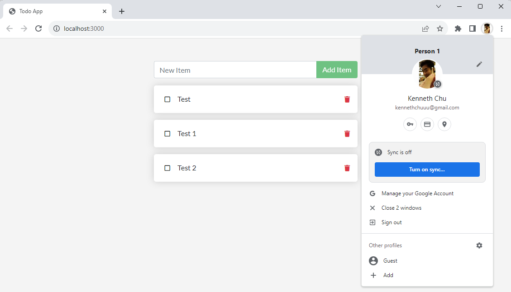

# CSP451-Azure-Project

### Checkpoint7 Submission

- **COURSE INFORMATION: CSP451NIA**
- **STUDENT’S NAME: Kenneth Chu**
- **STUDENT'S NUMBER: 158945204**
- **GITHUB USER_ID: 158945204-myseneca**
- **TEACHER’S NAME: Atoosa Nasiri**

---

# Table of Contents
1. [Part A - Working with Docker Desktop](#part-a---working-with-docker-desktop)
2. [Part B - Run Your Own Container](#part-b---run-your-own-container)
3. [Part C - Run Docker Hub Image](#part-c---run-docker-hub-image)
4. [Part D - Publish Your Images](#part-d---publish-your-images)

## Part A - Working with Docker Desktop

### Running Container
The following is an image of Docker Desktop showing a running container

### Stopped Container
The following is an image of Docker Desktop showing a stopped container

## Part B - Run Your Own Container

Here is the output of a running container

## Part C - Run Docker Hub Image

Here is an updated output of changes made to a Docker Hub Image

## Part D - Publish Your Images

Here is the output of pushing images to a container on DockerHub

Here is what the container looks like on the web interface

