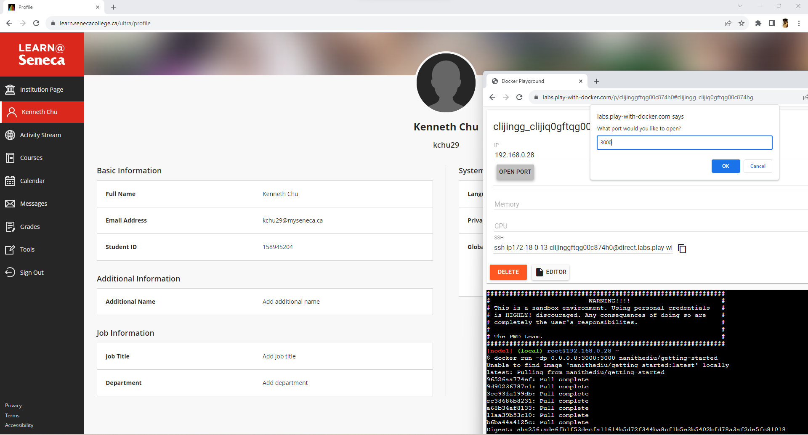

# CSP451-Azure-Project

### Checkpoint8 Submission

- **COURSE INFORMATION: CSP451NIA**
- **STUDENT’S NAME: Kenneth Chu**
- **STUDENT'S NUMBER: 158945204**
- **GITHUB USER_ID: 158945204-myseneca**
- **TEACHER’S NAME: Atoosa Nasiri**

---

# Table of Contents
1. [Part A - Containerize an application](#part-a---containerize-an-application)
2. [Part B - Share the application](#part-b---share-the-application)
3. [Part C - Persist the DB](#part-c---persist-the-db)
4. [Part D - Use bind mounts](#part-d---use-bind-mounts)
5. [Part E - Multi-container apps](#part-e---multi-container-apps)
6. [Part F - Use Docker Compose](#part-f---use-docker-compose)

## Part A - Containerize an application

**Question1: If you run docker build -t getting-started . for a second time, the build time will be different from first time, why? Why the number of steps are also different? Explain your answers in detail.**
>Running 'docker build -t getting-started .' again might be faster or slower because the time it takes and the number of steps can be different. If nothing in the process has changed, Docker might recall and reuse what it already knows, making things quicker. However, if you alter anything or add something new, it has to start fresh for those aspects. So, the build time and the reported steps depend on what's changed and what Docker can reuse from the last build.

**Question2: What does -t flag do? If you do not use it what is the error? embed the error in your answer.**
>'-t' in the 'docker build -t getting-started .' command gives the Docker image a name, like "getting-started." If we were to skip it, no big errors should pops up, but the image gets a generic name based on a randomly generated ID, making it less friendly to work with. So, using -t just makes life easier when dealing with our Docker images.

**Question3: Run docker build -t getting-started . a few times and then run docker image ls to get the list of your images, why do you still one image listed even though you have tried building image many times?**
>When we run 'docker build -t getting-started .' a bunch of times, I noticed only one image listed when I do 'docker image ls'. This is because Docker is able to keep caches of items to speed things up. Even though I built it multiple times, it keeps using the same name "getting-started" for the image, so I only see one in the list.

**Question4: What are -d and -p flags? What does each flag do? Start another git bah or wsl terminal and run docker run -p 1000:3000 getting-startedin it, Notice that -d is missing. What is the output?Embed it in your submission. Explain why this happened?**
>The '-d' flag in docker run -d stands for 'detatch' and it lets the container run in the background, so I can keep using the terminal. On the other hand, the '-p' flag stands for publish in 'docker run -p 1000:3000' maps port 1000 on the computer to port 3000 in the container, allowing me to access stuff inside. Now, if I were to run 'docker run -p 1000:3000 getting-started' without the -d flag, my terminal gets stuck showing the container's output until I manually stop it.

```
Kenne@NaniTheDiu MINGW64 ~/Seneca/dockerworkfolder/getting-started/app (master)
$ docker run -p 1000:3000 getting-started
Using sqlite database at /etc/todos/todo.db
Listening on port 3000
```


**Question5: The previous question has created a new container with your app running in it. Which port in localhost must be used to reach it?**
>Ports 1000 or 3000 must be used to reach the container
```
http://localhost:1000/
http://localhost:3000/
```

**Question6: Run docker ps and embed the output in your answer. If you have completed previous questions, you should have at least two containers running in your system. What is their difference? Can you explain how and why this was necessary?**
> The differences lie in the ports and the names that it was given.
```
docker ps
```
| CONTAINER ID   | IMAGE             | COMMAND                  | CREATED              | STATUS              | PORTS                      | NAMES            |
|----------------|-------------------|--------------------------|----------------------|---------------------|----------------------------|-------------------|
| 74dc3448c06e   | getting-started   | "docker-entrypoint.s…"   | About a minute ago   | Up About a minute   | 0.0.0.0:1000->3000/tcp     | gifted_hawking   |
| b56c77d2e502   | getting-started   | "docker-entrypoint.s…"   | About a minute ago   | Up About a minute   | 127.0.0.1:3000->3000/tcp   | gallant_turing   |

**Question7: How long did it take to create the image after you updated the code? It is still shorter than the first time you did it, why?**
> It did not take long to create the image after updating the code. The build was really fast because Docker's caching system had cached the layers from the previous build

**Question8: What is the error message you get when you try to run the app container? Embed the error in your submission and explain why do you get this error at all?**
> Docker couldn't find the 'd94b23afee94:latest' image on the computer, and when it tried to fetch it, access got denied. This is because it's either a private image or doesn't exist in the repository. 

```
Unable to find image 'd94b23afee94:latest' locally
docker: Error response from daemon: pull access denied for d94b23afee94, repository does not exist or may require 'docker login': denied: requested access to the resource is denied.
See 'docker run --help'.
```

**Question9: Repeat all the step for app update for: No tasks to do for CSP451 yet! Add one above! and embed a screenshot of your app in your submission.**
>

## Part B - Share the application
>


## Part C - Persist the DB
>

## Part D - Use bind mounts
>

## Part E - Multi-container apps
>

## Part F - Use Docker Compose
```
services:
  app:
    image: node:18-alpine
    command: sh -c "yarn install && yarn run dev"
    ports:
      - 127.0.0.1:3000:3000
    working_dir: /app
    volumes:
      - ./:/app
    environment:
      MYSQL_HOST: mysql
      MYSQL_USER: root
      MYSQL_PASSWORD: secret
      MYSQL_DB: todos

  mysql:
    image: mysql:8.0
    volumes:
      - todo-mysql-data:/var/lib/mysql
    environment:
      MYSQL_ROOT_PASSWORD: secret
      MYSQL_DATABASE: todos

volumes:
  todo-mysql-data:
```
>